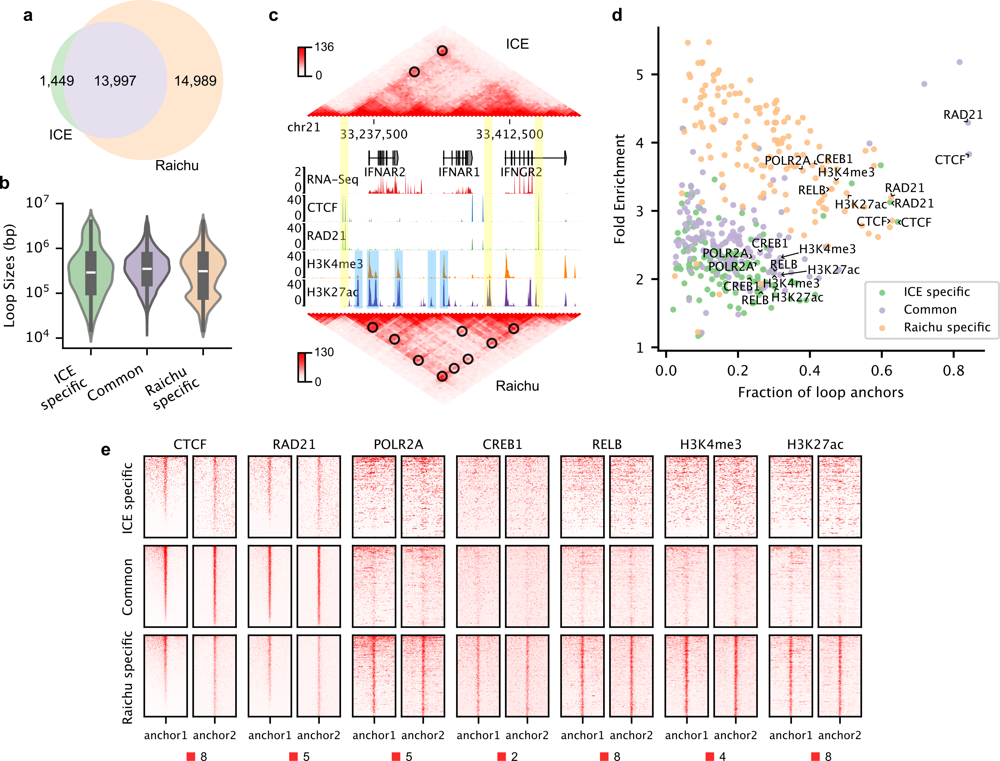

Raichu 
======
Accurately detecting enhancer-promoter loops from genome-wide interaction data,
such as Hi-C, is crucial for understanding gene regulation. Current normalization
methods, such as Iterative Correction and Eigenvector decomposition (ICE), are
commonly used to remove biases in Hi-C data prior to chromatin loop detection.
However, while structural or CTCF-associated loop signals are retained,
enhancer-promoter interaction signals are often greatly diminished after ICE
normalization and similar methods, making these regulatory loops harder to detect.
To address this limitation, we developed Raichu, a novel method for normalizing
chromatin contact data. Raichu identifies nearly twice as many chromatin loops as
ICE, recovering almost all loops detected by ICE and revealing thousands of additional
enhancer-promoter loops missed by ICE. With its enhanced sensitivity for regulatory
loops, Raichu detects more biologically meaningful differential loops between conditions
in the same cell type. Furthermore, Raichu performs robustly across different sequencing
depths and platforms, making it a powerful tool for uncovering new insights into 3D genomic
organization and transcriptional regulation.

Installation
============
Raichu and all the dependencies can be installed through either `mamba <https://github.com/mamba-org/mamba>`_
or `pip <https://pypi.org/project/pip/>`_::

    $ conda config --append channels defaults
    $ conda config --append channels bioconda
    $ conda config --append channels conda-forge
    $ mamba create -n 3Dnorm cooler numba joblib
    $ mamba activate 3Dnorm
    $ pip install raichu

Raichu is a command-line tool, and after successful installation, help information
can be accessed by running ``raichu -h`` in a terminal.

Usage
=====
Raichu is built on the `cooler <https://github.com/open2c/cooler>`_ Python package
for reading and processing contact matrices. To demonstrate how to normalize a
contact matrix in .cool format,
let's download a .cool file "GM12878.Hi-C.10kb.cool" by following this
`link <https://www.jianguoyun.com/p/DUoSz7gQh9qdDBi5lLwFIAA>`_, which contains
contact matrices at the 10kb resolution, generated from an in situ Hi-C dataset
in the GM12878 cell line.

.. note:: Raichu is also applicable to other 3D genomic platforms,
    such as Micro-C, HiChIP, and ChIA-PET.

Now all that is needed is to execute the commands below in a terminal:

    $ raichu --cool-uri GM12878.Hi-C.10kb.cool --window-size 200 -p 8 -n obj_weight -f

Here:

1. The parameter "--cool-uri" specifies the URI of contact matrices at
a certain resolutions. The value should be the file path for a single-resolution
cooler file (usually suffixed with ".cool"), and for a multi-resolution
cooler file (usually suffixed with ".mcool"), the value should be the file path
followed by ``::`` followed by the internal group path to the root of a data
collection, such as "test.mcool::resolutions/10000", "test.mcool::resolutions/5000",
etc.
2. The parameter "--window-size" specifies the sliding window size, which
can be set to the default value 200 for most cases, increasing its value may
get more accurate calculation of the bias vectors with a cost of more running time.
3. The parameter "-p" or "--nproc" determines how many processes to be allocated
to perform the calculation. Based this parameter, Raichu performs the calculation
for chromosomes in parallel. So setting this parameter to a value greater than
the number of chromosomes won't get additional speed improvement.
4. The parameter "-n" or "--name" specifies the name of the column to write
the calculated bias vectors.
5. If the parameter "-f" or "--force" is specified, the target column
in the bin table will be overwritten if it already exists.

Downstream Analysis with Raichu-Normalized Matrices
===================================================
Raichu stores the calculated bias vectors exactly the same way as
``cooler balance`` (an implementation of the ICE algorithm), ensuring
seamless compability with downstream tools for analyzing compartments,
TADs, and loops.

For example, to compute the chromatin compartment values based on the
Raichu-normalized signals, we can run the
`cooltools eigs-cis  <https://github.com/open2c/cooltools>`_ command by
specifying the ``--clr-weight-name`` parameter to "obj_weight" (based on
your ``-n`` setting when you ran raichu). The full command should look like
this:

    $ cooltools eigs-cis --phasing-track hg38-gene-density-100K.bedGraph --clr-weight-name obj_weight -o GM_raichu GM12878-MboI-allReps-hg38.mcool::resolutions/100000

Similarly, the following command can be used to compute insulation scores
using the Raichu-normalized signals:

    $ cooltools insulation --ignore-diags 1 -p 8 -o GM_raichu.IS.25kb.tsv --clr-weight-name obj_weight GM12878-MboI-allReps-hg38.mcool::resolutions/25000 1000000

For loop detection, numerous methods can be selected. We have tested
the `pyHICCUPS <https://github.com/XiaoTaoWang/HiCPeaks>`_, `Mustache <https://github.com/ay-lab/mustache>`_,
and `Peakachu <https://github.com/tariks/peakachu>` software.

Here is an example command using pyHICCUPS (v0.3.8):

    $ pyHICCUPS -p GM12878.Hi-C.10kb.cool -O GM12878_pyHICCUPS_test.bedpe --pw 1 2 4 --ww 3 5 7 --only-anchors --nproc 8 --clr-weight-name obj_weight --maxapart 4000000

And here is an example command using Mustache (v1.3.2):

    $ mustache -f GM12878-MboI-allReps-hg38.mcool -r 10000 -pt 0.05 -norm obj_weight -p 8 -o GM12878_mustache_test.tsv

Performance
===========
In GM12878 cells, ICE detected only 15,446 loops in GM12878 cells, while Raichu
identified 28,986 loops (Here pyHICCUPS is applied, however, we showed in the
manuscript that various loop calling methods can obtain a similar level of
improvement on loop detection using Raichu-normalized signals). Furthermore,
90.6% of loops detected by ICE (13,997 out of 15,446) were also identified by
Raichu, while 51.7% of loops detected by Raichu (14,989 out of 28,986) were missed
by ICE.

We divided loops into three categories: loops unique to ICE (ICE-specific), loops
unique to Raichu (Raichu-specific), and loops detected by both ICE and Raichu (Common).
Strikingly, we observed that while ICE-specific and Raichu-specific loops exhibited
comparable enrichment for CTCF and RAD21, Raichu-specific loops demonstrated substantially
greater enrichment for a broader range of TFs and histone modifications closely associated
with transcriptional regulation, including RNA polymerase II (POLR2A), CREB1, RELB, H3K4me3,
and H3K27ac.

