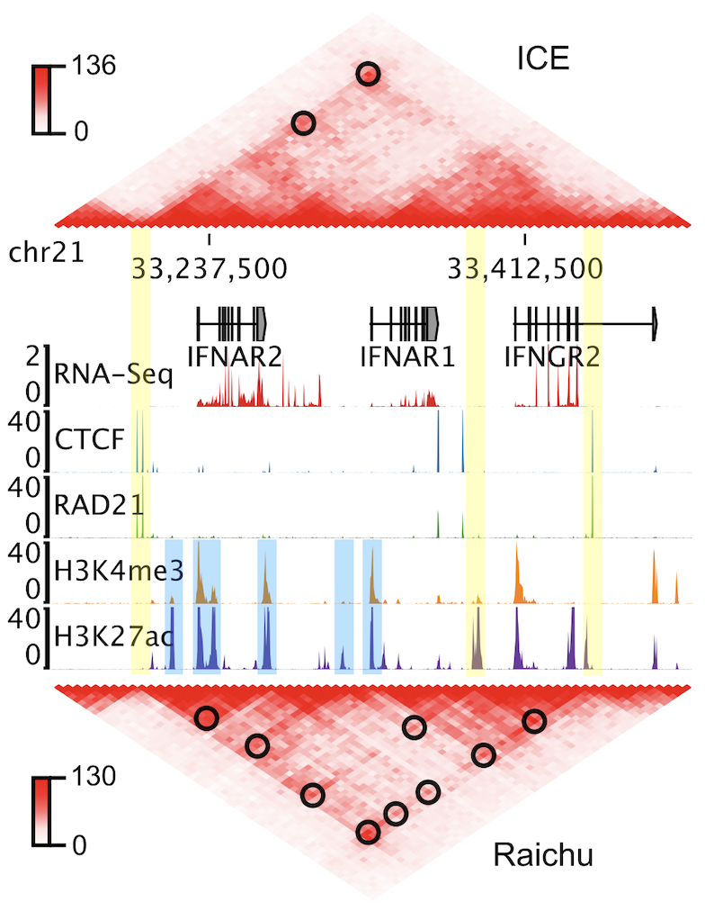

Raichu 
======
Accurately detecting enhancer-promoter loops from genome-wide interaction data,
such as Hi-C, is crucial for understanding gene regulation. Current normalization
methods, such as Iterative Correction and Eigenvector decomposition (ICE), are
commonly used to remove biases in Hi-C data prior to chromatin loop detection.
However, while structural or CTCF-associated loop signals are retained,
enhancer-promoter interaction signals are often greatly diminished after ICE
normalization and similar methods, making these regulatory loops harder to detect.
To address this limitation, we developed Raichu, a novel method for normalizing
chromatin contact data. Raichu identifies nearly twice as many chromatin loops as
ICE, recovering almost all loops detected by ICE and revealing thousands of additional
enhancer-promoter loops missed by ICE. With its enhanced sensitivity for regulatory
loops, Raichu detects more biologically meaningful differential loops between conditions
in the same cell type. Furthermore, Raichu performs robustly across different sequencing
depths and platforms, making it a powerful tool for uncovering new insights into 3D genomic
organization and transcriptional regulation.

Installation
============
Raichu and all the dependencies can be installed through either `mamba <https://github.com/mamba-org/mamba>`_
or `pip <https://pypi.org/project/pip/>`_::

    $ conda config --append channels defaults
    $ conda config --append channels bioconda
    $ conda config --append channels conda-forge
    $ mamba create -n 3Dnorm cooler numba joblib
    $ mamba activate 3Dnorm
    $ pip install raichu

Raichu is a command-line tool, and after successful installation, help information
can be accessed by running ``raichu -h`` in a terminal.

Usage
=====
Raichu is based on the cooler Python package for contact matrix reading and 
processing. To illustrate how to normalize a 

Downstream Analysis with Raichu-Normalized Matrices
===================================================

Performance
===========

